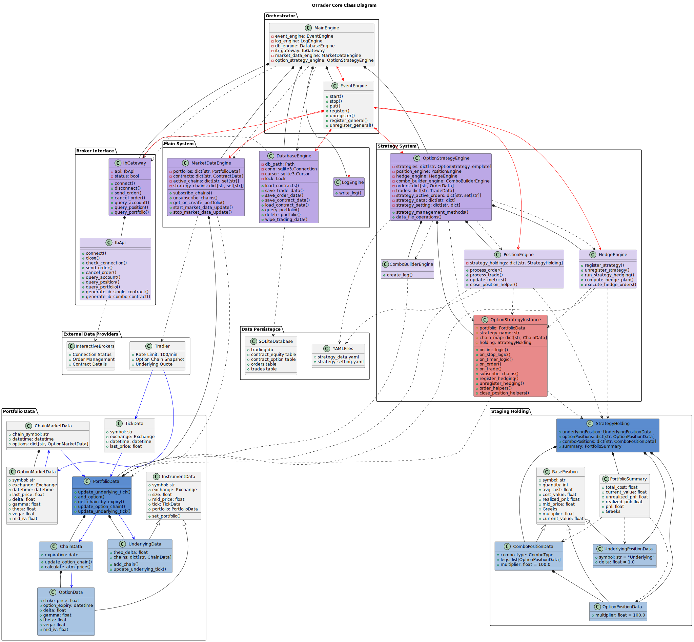

# OTrader

<div align="center">

*A strategy-oriented live option trading platform that supports your own quantitative option strategies*

> **[C++ version](Otrader_cpp/):** Work in progress

---

<pre>
    ___  _____              _           
   / _ \|_   _| __ __ _  __| | ___ _ __ 
  | | | | | || '__/ _` |/ _` |/ _ \ '__|
  | |_| | | || | | (_| | (_| |  __/ |   
   \___/  |_||_|  \__,_|\__,_|\___|_|   
</pre>
---

[](https://www.python.org/downloads/)
[](https://opensource.org/licenses/MIT)
[](https://www.interactivebrokers.com/)
[](https://tradier.com/)
[](https://github.com/astral-sh/ruff)
[](https://github.com/python/mypy)

</div>


<div align="center">

**[English](readme.md)** / **[中文](doc/zh/readme_zh.md)**

</div>

## Overview

OTrader is a strategy-oriented options trading platform designed for algorithmic options trading. It provides a comprehensive feature set to support the full trading lifecycle, and the **strategy template** allows traders to build and deploy their own options strategies with ease.

## Features

- **Position Tracking:** Strategy-level tracking for underlying, single-leg and combo options
- **Risk Management:** Aggregate Greeks, realised & unrealised PnL monitoring
- **Market Data:** Real-time Tradier market data feed: equity + options snapshot
- **Hedging Engine:** Strategy-level automatic delta hedging
- **Strategy Runtime:** Multi-strategy support, independent lifecycle management
- **Persistence Layer:** SQLite storage for option listings & execution history
- **Strategy State Storage:** YAML persistence for strategy parameters & holdings


## Architecture

The platform is built with a modular, event-driven architecture. 

A strong focus is placed on code quality and efficiency—crucial for live trading—resulting in a robust, reliable system. The architecture is intentionally crafted to provide a clean, streamlined design with minimal complexity.

The core system comprises only about 3000 lines of code.

A simple server backend is built with FastAPI, while an HTML and vanilla JS frontend provides a lightweight control panel to operate and monitor the system.

For more detailed engine design, view **[Engine Document](doc/doc_engines.md)**

### Core System Architecture



## Installation

#### 1. Install Interactive Brokers API

Download and install `ibapi` from the [Interactive Brokers TWS API](https://interactivebrokers.github.io/).

For detailed installing instructions, refer to the [IBKR official tutorial](https://www.interactivebrokers.com/campus/trading-lessons/what-is-the-tws-api/).

Download and install IBKR TWS/Gateway.

After installation of ibapi and TWS/Gateway, go to setting and disable "Read-Only API" and enable "Bypass order precautions".

**Important:** Connecting to Live account is not recommended!!! 

#### 2. Obtain a Tradier API (production API, not sandbox)

#### 3. Clone the Repository

```bash
git clone https://github.com/your-username/OTrader.git
cd OTrader
```

#### 4. Install Dependencies

```bash
pip install -r requirements.txt
```

#### 5. Configure Environment

```bash
cp .env.example .env
# Edit the .env file with your Tradier production API credentials (do not use sandbox keys)
```

#### 6. Prepare Option Data (Download Option Listings)

To save option chains for your target symbols, set the portfolios you want to store and enable symbol updating:

- Open `engine_db.py` and adjust these lines:

  ```python
  REQUIRED_SYMBOLS = ["SPX-USD-IND-CBOE", "AMZN-USD-STK-SMART"]  # Add/remove as needed
  AUTOMATIC_UPDATE_SYMBOLS = True              # Set to True for automatic update
  ```

- **Note:**  
  - Each symbol may take 3–10 minutes to query, depending on IBKR server traffic.
  - It is recommended to query every week to stay updated with new option listings.
  - The system automatically clears expired option contracts.

#### 7. Run the Demo Script with a Sample Strategy

```bash
python run_script.py # script version is more realiable
```

#### 8. Start the System with GUI

```bash
python run_server.py
```


## Strategy Development

OTrader provides a comprehensive strategy development framework with built-in portfolio management, order interfaces, and position tracking. 
The system handles complex infrastructure while allowing you to focus on core trading logic.

For detailed strategy development guide, see the **[Strategy Template Guide](doc/doc_strategy.md)** which covers:

- Strategy implementation patterns and best practices
- Position management and risk controls
- Use hedge engine for delta hedge
- Order execution and combo order handling
- Market data integration and chain management
- Error handling and logging strategies
- Complete strategy examples and templates

## License & Attribution

This project is licensed under the MIT License.

This project is heavily inspired by [vn.py](https://github.com/vnpy/vnpy), originally created by **Xiaoyou Chen**,  and extends the design and architecture concepts in significant ways.

## Development

### Development Setup

For anyone who wish to contirbute

#### 1. Install Development Dependencies and use code quality tools

```bash
pip install -r requirements-dev.txt
```

```bash
pre-commit install
```

#### 2. Configuration

Code quality settings are configured in `pyproject.toml`:
- Line length: 140 characters
- Python version: 3.12+
- Type checking enabled for core modules
- Relaxed typing for backend/frontend modules

## Support

If you find any bugs or have suggestions on design, feel free to email me at **hang.zhengyang1010@gmail.com**.

## Disclaimer

This project is for educational and research purposes only. It may contain undiscovered bugs and has not been tested in a production environment. Connecting to a live account is strongly discouraged. Trading carries a substantial risk of loss. Use at your own risk.
