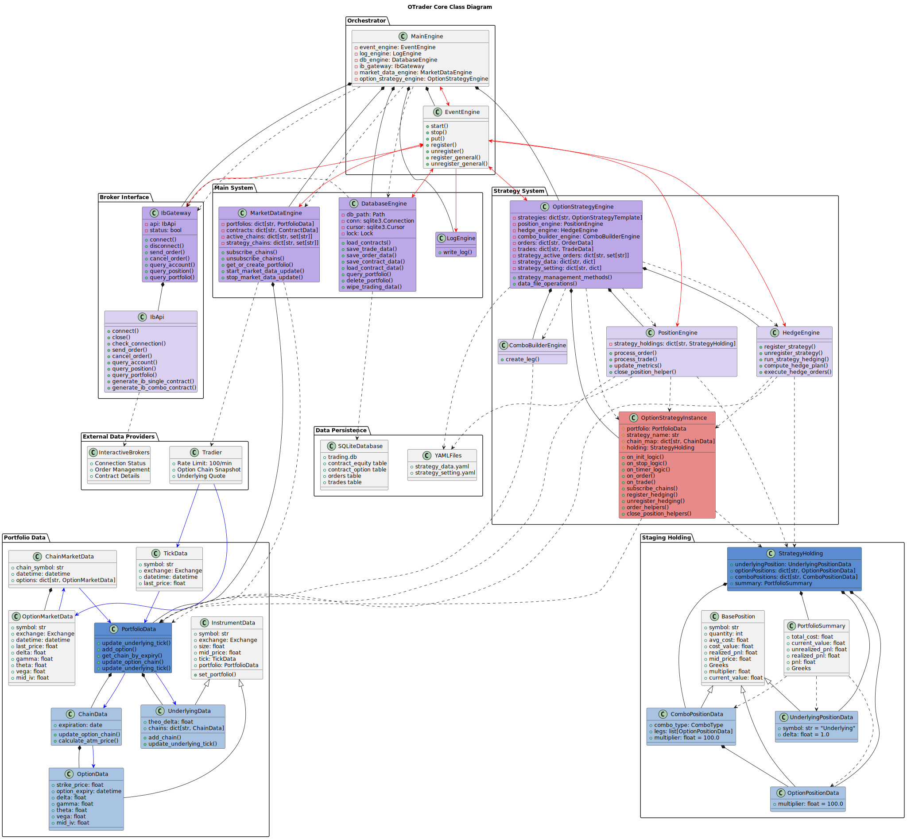

# System Architecture

## Overview

OTrade a sophisticated options trading platform built with a modular engine architecture. The system uses an event-driven design pattern where engines communicate through a centralized event system, enabling loose coupling and high scalability.

## Summary of Workflow

**IbGateway** - Handles order management and contract queries. We need to keep a local reference of all the available option listings in Interactive Brokers.

**DatabaseEngine** - Stores the option listings in a local database and trade/order data generated when running the system.

**MarketDataEngine** - Takes all contracts and groups them into portfolio data for each strategy access. It consistently pulls live market data from Tradier and injects live data into portfolio objects.

**StrategyEngine** - Manages strategy lifecycle and provides wrapper methods for sub-engines to call each other. Manages active orders by each strategy and caches all order and trade data.

**ComboBuilder** - Takes option data as input and returns built option combos.

**PositionEngine** - Maintains one strategy holding instance for each strategy. Reacts to trade and order events to update position holdings and responds to timer events to recalculate metrics. Also provides helpers to close positions.

**HedgeEngine** - Automatic delta hedge registered by needed strategies. Reads position data for delta values, plans hedge and uses strategy instances order helper to place underlying trades.

**OptionStrategyTemplate** - Integrates all system features into it. Provides utilities to pick chains to subscribe to live data, extremely simple order helpers to place underlying, option and combo option trades.

## System Architecture

## Customization

The modular architecture allows you to easily extend and customize the system:

- **Replace Market Data Engine**: Swap out Tradier for other data providers (Bloomberg, Reuters, etc.)
- **Add New Combo Types**: Extend the ComboBuilder with additional option strategies
- **Enhance Portfolio Data**: Add built-in methods for more efficient option selection logic
- **Create Custom Engines**: Plug in new engines or modify existing ones to fit your needs

The system is designed to be flexible and extensible, allowing you to adapt it to your specific trading requirements.

## Engine Details

## MainEngine - System Orchestrator
**Purpose**: Central coordinator that manages all subsystems and provides unified interfaces

**Key Responsibilities**:
- Initialize and coordinate all engines
- Provide unified gateway interfaces (connect, disconnect, send_order, etc.)
- Primary engines expose their public methods in main, to be called by each other

## EventEngine - Communication Hub
**Purpose**: Centralized event distribution system enabling loose coupling between engines

**Key Responsibilities**:
- Distribute events to registered handlers
- Generate timer events for periodic operations
- Manage event queues and threading
- Support both specific event type handlers and general handlers

## LogEngine - Centralized Logging
**Purpose**: Unified logging system for all engines

**Key Responsibilities**:
- Process log events from all engines
- Output to console, file, and WebSocket
- Support different log levels (DEBUG, INFO, WARNING, ERROR, CRITICAL)
- Use loguru for advanced logging features

**Features**:
- Multi-level logging with structured output
- Daily log file rotation
- Gateway-specific logging tracking
- WebSocket integration for real-time logging

## DatabaseEngine - Data Persistence
**Purpose**: Persistent storage for trading data and system state

**Key Responsibilities**:
- Store order data, trade data, and contract information, lists of contracts available in exchange
- Provide thread-safe database operations
- Manage SQLite database connections
- Support data serialization and restoration
- Load contract data and generate contract events for market engine to construct portfolio

## IbGateway - Trading Interface
**Purpose**: Interface with Interactive Brokers (IB) for order execution and account management

**Key Responsibilities**:
- Connect to IB TWS/Gateway
- Execute orders and manage order lifecycle
- Query account and position information
- Convert between IB and internal data formats
- Handle contract discovery and caching

## MarketDataEngine - Independent Market Data Provider
**Purpose**: Independent market data provider that operates autonomously from the strategy engine

**Key Responsibilities**:
- Manage portfolio data containers, construct portfolio data while database loads contracts
- Fetch market data from Tradier API with rate limit
- Register and unregister strategy active chains
- Track active option chains, group by strategy and portfolio
- Form data objects and inject into portfolio data

**Features**:
- Tradier API integration with rate limiting (60 calls/minute)
- Real-time Greeks data (Delta, Gamma, Theta, Vega, IV)
- Independent operation from strategy engine
- Portfolio data organization and management

## OptionStrategyEngine - Strategy Management
**Purpose**: Central hub for options trading strategies

**Key Responsibilities**:
- Load and manage strategy classes
- Order wrapper for strategy instance, create order request and pass to gateway
- Manage strategy lifecycle (init, start, stop, restore, remove, delete)
- Coordinate with subsidiary engines, combo builder, position and hedge
- Strategy holding and strategy data persistence, save and load
- Forward trade and order data for position engine to manage positions

**Features**:
- Multi-strategy concurrent execution
- Strategy recovery from configuration files
- Event-driven strategy execution
- Comprehensive error handling with strategy isolation

## PositionEngine - Position Management
**Purpose**: Manage per-strategy holdings and position operations

**Key Responsibilities**:
- Track strategy-specific positions: underlying, single leg and combo options
- Update positions data based on trades and order
- Serialize/deserialize position data
- Organize combo positions and their legs by mapping orders to trades
- Provide position related data queries

**Features**:
- Real-time position tracking
- Multi-leg combo position management
- Greeks aggregation across positions
- P&L tracking (realized and unrealized)
- Position data persistence and restoration

## HedgeEngine - Risk Management
**Purpose**: Centralized hedging system for risk management

**Key Responsibilities**:
- Provide strategy delta hedging
- Register strategies for hedging
- Monitor delta exposure and execute hedge orders
- Manage hedge order lifecycle
- Provide risk management controls

**Features**:
- Automated delta-neutral hedging
- Multi-strategy hedge management
- Real-time delta monitoring
- Smart hedge order execution
- Configurable delta targets and ranges

## ComboBuilderEngine 
**Purpose**: Helper component for strategy instance to build combo orders easily

- Support dozens of order combo types
- Retrieve contracts and build combos with differentiable signatures